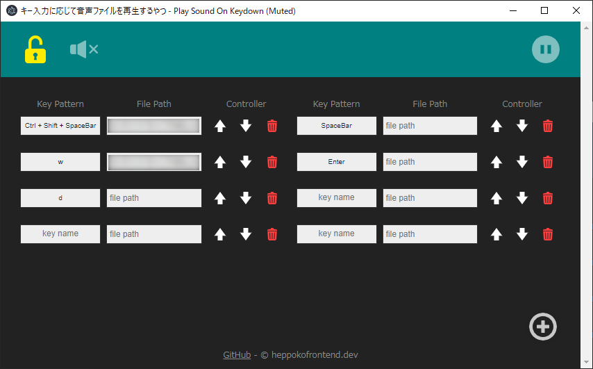

# ⌨🎵 キー入力に応じて音声ファイルを再生するやつ

  

任意のアプリケーションを利用中でも、好きなキー入力に応じて  
あらかじめ用意した音声ファイルが再生できます。

`Ctrl+S`に「保存音声」を登録したりしてシステム音声として使うもよし。  
配信などで収録済みの音声を手軽に再生したい時にもどうぞ。

## 🥒 Download

[Download](https://github.com/heppokofrontend/play-sound-on-keydown/releases)

## 🥒 How to use

1. zipファイルを解凍
2. `play-sound-on-keydown.exe`を起動　
3. 画面左上の鍵アイコンをクリック（Edit Mode）
4. 「**File Path**」に好きなオーディオファイルのパスを指定します（入力またはドロップ）
5. 「**Key**」に好きなキー名を入力します
6. 画面左上の鍵アイコンをクリック（Watch Mode）
7. 登録したキーを好きなときに入力します

- 鍵アイコン（Edit Mode） - モードの切り替えを行います
- 音声アイコン（Mute） - 音声をミュートします
  - アプリケーションのタイトルに **(Muted)** が追加されます
- 停止ボタン（Stop all） - 再生中の音声をすべて停止します
  - 再生中のみ押下できます
- プラスボタン（Add） - 音声設定を1つ追加します

### Watch Mode

#### Key Pattern - \[ReadOnly]

ここに書かれたキーを入力すると、File Nameに設定された音声が再生されます。

#### File Name - \[ReadOnly]

再生される音声ファイルの名前です。

#### Volume

再生される音声ファイルの音量が調整できます。

### Edit Mode

#### Key Pattern

その音声を再生するためのキー入力設定です。
　
- 重複登録すると同時に再生されます
- `Ctrl` or `Shift` or `Alt`の同時押しをサポートしています
  - 「`Ctrl`、`Shift`、`Alt`のうち最大2種類＋任意のキー」までの組み合わせに対応しています
- 一部のキーはサポートしていません
  - タブキー
  - 矢印キー
  - ファンクションキー（F1～F12）
  - その他、`NonConvert`, `Alphanumeric`, `Hankaku`, `Zenkaku`, `ScrollLock`, `Cancel`, `Pause`, `Pause`, `Insert`, `Home`, `PageUp`, `Delete`, `End`, `PageDown`, `NumLock`, `Clear`, `ContextMenu`, `Convert`, `Process`　etc...

#### File Path

音声ファイルのファイルパスを入力するか、ドラッグ＆ドロップで指定します。

#### File Path

`Ctrl` or `Shift` or `Alt`の同時押しをサポートしています。

#### Controller

- 音声設定の順番を変更します
- 音声設定を削除します

## 🥒 Special Thanks

App logo designed by [雨瀬おるこ](https://twitter.com/Amase_Oruko)

Inspired by [効果音プレイヤー SimpleSoundPlayer 2014](https://www.gigafree.net/media/music/SimpleSoundPlayer.html)

## 免責事項

モックのつもりで作ったものです。もろもろご容赦ください。

このツールはローカルパスが画面上に表示されます。  
LIVE配信時等、ローカルパスの流出に十分ご注意ください。

[不具合などありましたらこちらから](https://github.com/heppokofrontend/play-sound-on-keydown/issues/new)お知らせ頂けると嬉しいです。
